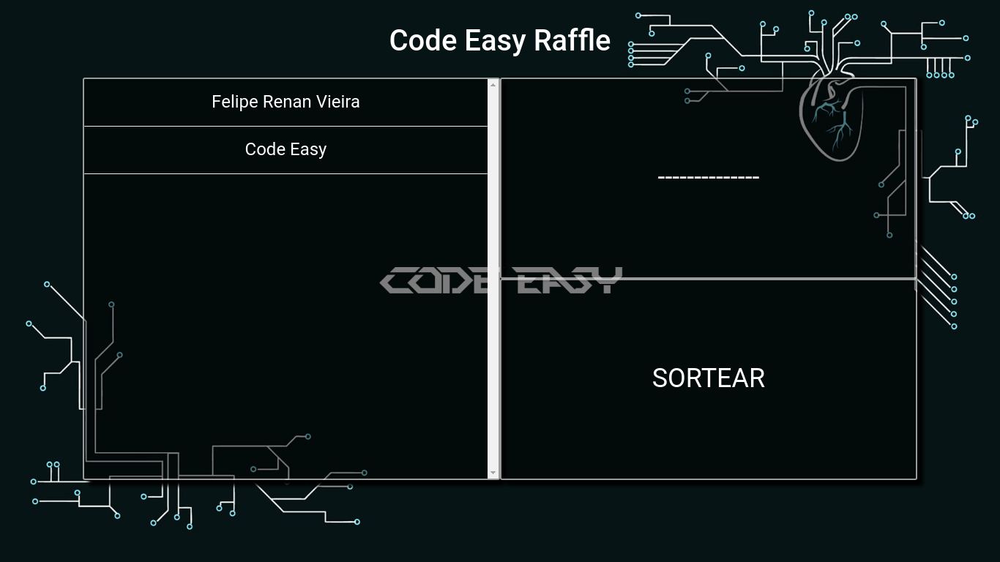

# Code Easy Raffle



O __Code Easy Raffle__ é o software de sorteio da Code Easy, um software simples, usado para fins didáticos e, quem sabe, para futuros sorteios que possam surgir na Code Easy.

Este software foi construído para demonstrar um exemplo simples de React com TypeScript e também de Sistemas Distribuídos, já que no diretório `src/services/` é possível desenvolver módulos que permitem a integração com qualquer coisa que provenha os dados para o sorteio (APIs REST, GraphQL, CSV, JSON, ...).

## SETUP

__Execute:__ `npm install` ou `yarn install`

__Execute:__ Vá em `src/services/googleForms/csv` e faça o que está descrito no README.md nesse diretório

OBS: O código nesse diretório captura os dados de um CSV que contém os usuários a serem sorteados na seguinte estrutura:

```csv
Carimbo de data/hora,Nome,E-mail,Receber e-mails?
,,,
01/01/2019 00:00:00,NOME,EMAIL@email.com,Quero receber e-mails (Preenche o campo e-mail)
```

Sendo apenas o nome e o e-mail os dados mais importantes

Qualquer alteração na estrutura do CSV é necessário alteração no código em `src/services/googleForms/csv` sendo que no final o mesmo deve retornar sempre `{id: number, name: string}`

__Execute:__ `npm start` ou `yarn start`
